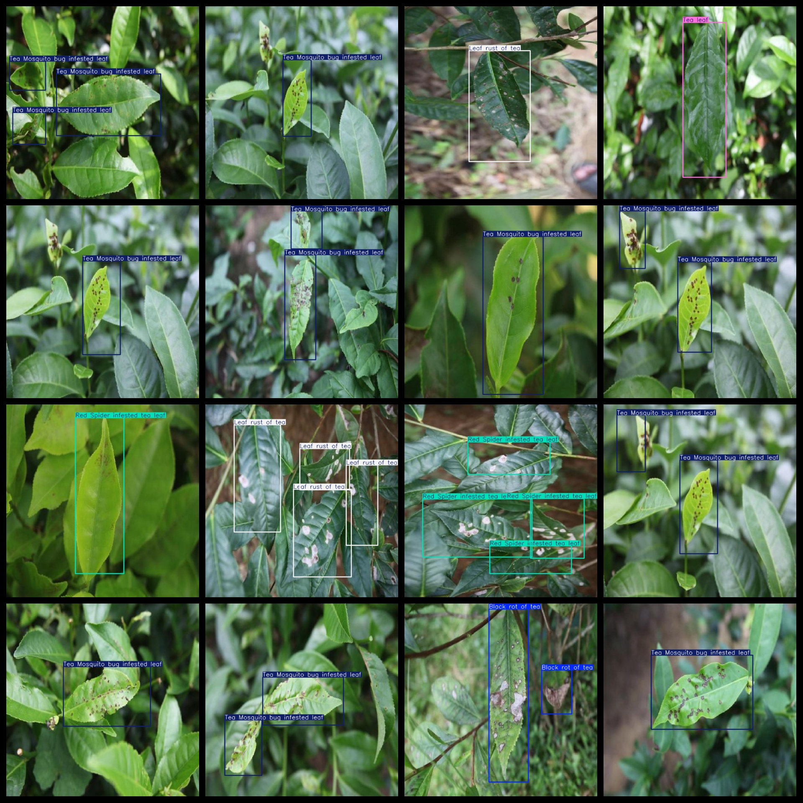
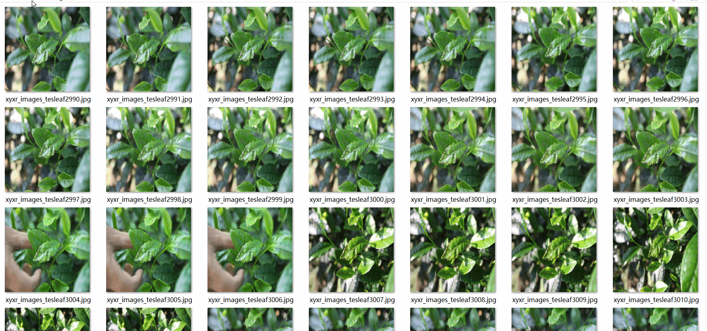

# Tea Disease Detection Dataset 9591 imagesVOC+YOLO format

Tea disease detection dataset 9591 VOC + YOLO format

Dataset format: Pascal VOC format + YOLO format (the txt file does not contain the split path, it only contains jpg images and corresponding VOC format xml files and yolo format txt files)

Number of images (number of jpg files): 9591

Number of xml files: 9591

Number of txt files: 9591

Tagged Category Count: 8

The Github repository is: datasets_sl

["Black rot of tea", "Brown blight of tea", "Leaf rust of tea", "Red Spider infested tea leaf", "Tea Mosquito bug infested leaf", "Tea leaf", "White spot of tea", "disease"]

Number of boxes labeled in each category:

Black rot of tea = 128 (black rot)

Brown blight of tea number of frames = 8 (brown spot)

Leaf rust of tea box number = 3645 (tea rust)

Red Spider infested tea leaf = 1022 (Red Spider)

Tea Mosquito bug infested leaf box number = 7254 (small green leafhopper)

Tea leaf box number = 427 (tea)

White spot of tea = 324 (white spot)

number of disease boxes = 4 (disease)

Total Frames: 12812

Number of images per category:

Black rot of tea annotated images = 99

Brown blight of tea occupies 8 images.

Leaf rust of tea with images = 2588

Red Spider infested tea leaf occupies 605 pictures.

Tea Mosquito bug infested leaf annotated images = 5540

The number of tea leaf pictures is 427.

White spot of tea occupies 324 images.

Number of images containing the disease = 4

Image resolution: 640x640

Use the labeling tool: labelImg

Dataset Augmentation: Yes

Rules for annotation: Draw a rectangle around the category.

Important note: The dataset does not have been divided into training, validation, and testing sets.

Special Disclaimer: This dataset does not guarantee the accuracy of the trained models or weight files.

Annotation and image details are as follows:

## Images

---

Here is a pay link on Stripe (https://buy.stripe.com/3cs8yP7sY87d0vu9AB). Please contact me lonlonago@foxmail.com after funding $89, and I will send you a complete data files, thank you!

